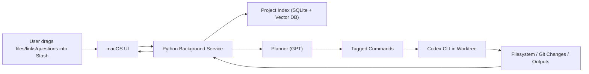

# Stash - Hackathon Build Plan

## 1) Vision and Outcome

**Stash** is a macOS overlay + assistant that lets users drop files/links/questions into one place, keeps project context indexed in the background, and triggers Codex-powered actions without context switching.

**North-star outcome for demo:** show a non-technical user create and organize real project outputs (docs/files/tasks/code changes) from one overlay.

---

## 2) Hackathon Constraints (Guardrails)

- Build window: **5 hours**
- Team size: up to **4**
- Must be **fully open source** (backend, frontend, integrations, prompts, scripts)
- Must be **new work during hackathon**
- Avoid banned categories and policy-risk use cases

---

## 3) Architecture (MVP)

## Components

1. **Frontend macOS app (SwiftUI)**
- Floating semi-transparent Stash icon overlay
- Drag/drop zone with visual feedback
- Expandable panel: project switcher, file list, quick actions, chat input
- Status feed (indexing, agent runs, task completion)

2. **Backend background process (Python)**
- Local service (FastAPI recommended) on `localhost`
- Watches project folders, indexes files/links/notes
- Runs Codex CLI tasks in controlled worktrees
- Manages skill usage (indexing skill + file/terminal execution skill)

3. **Context/Index Layer**
- Per-project metadata store (`SQLite`)
- Embeddings/vector index (local vector DB)
- Unified “project layer” abstraction so users see logical project context, not raw folders

4. **Agent Orchestration**
- GPT plans intent and task sequence
- Codex executes filesystem/code operations
- Tagged command protocol between planner output and executor

## High-Level Data Flow



---

## 4) Parallelization Strategy (Frontend vs Backend)

## Team Split

1. **Frontend Lead (macOS UI + UX)**
2. **Backend Lead (API + indexing + orchestration)**
3. **Integration Engineer (Codex CLI, worktrees, skill hooks, event streaming)**
4. **Demo/Pitch Engineer (script, sample data, judging-criteria proof, polish)**

## Workstream Dependencies

- Frontend and backend run in parallel after agreeing on API contract.
- Integration engineer unblocks both sides with mocked payloads first, then real wiring.
- Demo engineer can start early with seeded scenario and continuously validate “wow moments.”

---

## 5) API Contract (v2, Conversation-First)

**Transport:** Local HTTP JSON (`http://127.0.0.1:8765`) + SSE for live events.

## Conversation/History Use Cases (Non-Negotiable)

1. A single project (folder) supports **multiple conversations**.
2. Every conversation stores a **full transcript** (user, assistant, tool, system events).
3. User can **re-open any prior conversation** and continue from the latest state.
4. User can **branch/fork** a conversation into a new one for exploration.
5. User can view **project-scoped history** across all conversations.
6. User can search history by keyword, file/link reference, and time range.
7. Runs/tasks and outputs are linked back to the originating conversation/message.
8. Project switch restores last active conversation and recent context quickly.

## Core Entities

- `Project`: `{ id, name, root_path, created_at, last_opened_at, active_conversation_id }`
- `Conversation`: `{ id, project_id, title, status[active|archived], pinned, created_at, last_message_at, summary }`
- `Message`: `{ id, project_id, conversation_id, role[user|assistant|tool|system], content, parts[], parent_message_id, sequence_no, created_at }`
- `Run`: `{ id, project_id, conversation_id, trigger_message_id, status[pending|running|done|failed|cancelled], mode[manual|proactive], output_summary, created_at, finished_at }`
- `Asset`: `{ id, project_id, kind[file|link|note], title, path_or_url, tags[], indexed_at }`
- `MessageAttachment`: `{ id, message_id, asset_id, snippet_ref, created_at }`
- `Event`: `{ id, type, project_id, conversation_id, run_id, ts, payload }`

## Persistence Model (Local-First)

- `projects` table: project metadata; `root_path` is source of truth.
- `conversations` table: many conversations per project.
- `messages` table: append-only message log with `sequence_no`.
- `runs` + `run_steps` tables: execution trace mapped to messages.
- `assets` + `asset_chunks` + vector index: retrieval context.
- `events` table: SSE replay + debugging timeline.

All records include `project_id` for fast project-level history queries.

## Endpoint Surface

## Project Endpoints

### `POST /v1/projects`
Create/open project context (project maps 1:1 to folder root).

### `GET /v1/projects`
List projects for quick switcher.

### `GET /v1/projects/{project_id}`
Get project metadata plus active conversation.

### `PATCH /v1/projects/{project_id}`
Update project fields (rename, set `active_conversation_id`).

## Conversation Endpoints

### `POST /v1/projects/{project_id}/conversations`
Create new conversation inside project.

**Request**
```json
{
  "title": "Spec drafting",
  "start_mode": "manual"
}
```

**Response**
```json
{
  "id": "conv_001",
  "project_id": "proj_123",
  "title": "Spec drafting",
  "status": "active",
  "pinned": false,
  "created_at": "2026-02-05T10:00:00Z",
  "last_message_at": null
}
```

### `GET /v1/projects/{project_id}/conversations`
List conversations in project with pagination, sorting, and filters.

Query params:
- `cursor`
- `limit`
- `status=active|archived`
- `pinned=true|false`
- `q=<search text>`

### `GET /v1/projects/{project_id}/conversations/{conversation_id}`
Get conversation metadata.

### `PATCH /v1/projects/{project_id}/conversations/{conversation_id}`
Rename/pin/archive conversation.

### `POST /v1/projects/{project_id}/conversations/{conversation_id}/fork`
Create a new conversation branched from a selected message or latest state.

**Request**
```json
{
  "from_message_id": "msg_104",
  "title": "Alternative approach"
}
```

### `GET /v1/projects/{project_id}/conversations/{conversation_id}/transcript`
Export transcript as `json` or `markdown`.

## Message and Run Endpoints

### `POST /v1/projects/{project_id}/conversations/{conversation_id}/messages`
Append user message and optionally start run.

**Request**
```json
{
  "role": "user",
  "content": "Use this project context to draft a launch plan.",
  "asset_ids": ["asset_pdf_1", "asset_link_2"],
  "mode": "manual",
  "start_run": true,
  "idempotency_key": "1b91bc95-17da-4f20-a2eb-5ed0c0f8ce1f"
}
```

**Response**
```json
{
  "message_id": "msg_105",
  "run_id": "run_201",
  "status": "running"
}
```

### `GET /v1/projects/{project_id}/conversations/{conversation_id}/messages`
Load message history (cursor pagination by `sequence_no` or timestamp).

### `PATCH /v1/projects/{project_id}/conversations/{conversation_id}/messages/{message_id}`
Edit user message metadata (title/tags) or mark superseded (no destructive delete).

### `POST /v1/projects/{project_id}/conversations/{conversation_id}/messages/{message_id}/retry`
Regenerate assistant response from a specific message context.

### `GET /v1/projects/{project_id}/runs/{run_id}`
Get run status, timing, and step trace.

### `POST /v1/projects/{project_id}/runs/{run_id}/cancel`
Cancel in-flight run.

## Assets, Indexing, and Retrieval Endpoints

### `POST /v1/projects/{project_id}/assets`
Register dropped file/link/note.

### `POST /v1/projects/{project_id}/index`
Trigger (or retrigger) indexing for new/changed assets.

### `GET /v1/projects/{project_id}/index/jobs/{job_id}`
Read indexing status and diagnostics.

### `POST /v1/projects/{project_id}/search`
Project-scoped retrieval query (for proactive suggestions and grounding).

## History and Timeline Endpoints

### `GET /v1/projects/{project_id}/history`
Unified timeline (conversation events + runs + indexing activity).

### `POST /v1/projects/{project_id}/history/search`
Search across all conversations and run summaries in a project.

**Request**
```json
{
  "query": "launch plan blockers",
  "limit": 20,
  "include_archived": true
}
```

## Streaming Endpoint

### `GET /v1/projects/{project_id}/events/stream`
SSE stream for UI updates; filterable by `conversation_id`.

Event types:
- `conversation_created`
- `conversation_updated`
- `message_created`
- `message_delta`
- `message_finalized`
- `run_started`
- `run_step_started`
- `run_step_completed`
- `run_completed`
- `run_failed`
- `indexing_started`
- `indexing_progress`
- `indexing_completed`

### `POST /v1/projects/{project_id}/codex/execute`
Internal endpoint used by orchestrator to run tagged command payloads safely.

## Contract Rules (Critical)

- **Project is folder-bound:** each project has one `root_path`; all conversations are scoped to it.
- **Many conversations per project:** no global chat; all chats belong to one project.
- **Append-first history:** messages/events are append-only; edits create superseding state.
- **Soft-delete only:** archive conversations instead of hard delete in MVP.
- **Ordering guarantee:** `sequence_no` monotonic per conversation for deterministic replay.
- **Resumability:** reopening conversation returns last finalized assistant message + pending run state.
- **Replay:** timeline endpoint can rebuild exact session history for demo and debugging.

---

## 6) Tagged Command Protocol (GPT -> Codex)

Use parseable tags in planner output:

```text
<codex_cmd>
worktree: stash/proj_123
cwd: /Users/<user>/Desktop/Project1
cmd: create file PROJECT_BRIEF.md with sections...
</codex_cmd>
```

Backend parser extracts blocks, validates against allowlist, executes with Codex CLI, and returns structured results to planner loop.

---

## 7) Delivery Plan (5-Hour Timeline)

## 0:00-0:30 (Alignment + Contract Freeze)

- Lock MVP scope, success criteria, demo story
- Freeze API contract and event names
- Create repo skeleton and task board
- Seed 1 realistic demo project folder

## 0:30-2:30 (Parallel Build Sprint)

Frontend:
- Overlay icon, drag/drop, project list, expanded panel shell
- Chat input + activity feed UI with mocked events

Backend:
- FastAPI server scaffold
- Project/conversation/message/run endpoints
- File indexing pipeline + vector insert

Integration:
- Tagged command parser
- Codex execution adapter in worktree
- SSE event broadcaster

Demo/Pitch:
- Script v1 with before/after states
- Screenshots/video capture checkpoints
- Judging criteria mapping document

## 2:30-3:30 (Real Integration)

- Connect UI to live endpoints
- Replace mocks with real events
- Run 2 end-to-end flows and patch failures fast

## 3:30-4:30 (Polish + Reliability)

- Tighten UX transitions and status messaging
- Add guardrails (error states/timeouts/fallbacks)
- Open-source/license/readme cleanup

## 4:30-5:00 (Demo Lock)

- Freeze code except critical fixes
- Rehearse 3-5 minute demo twice
- Final pitch narrative + judging callouts

---

## 8) Final Super Plan (Execution Checklist)

## A. Build Priorities (Must/Should/Could)

**Must**
- Overlay drag/drop + project switch
- Multi-conversation support per project (folder-scoped)
- Full conversation history with resume/replay per project
- Background indexing per project
- Task prompt -> Codex execution -> visible result
- One polished end-to-end demo flow

**Should**
- Proactive suggestions from indexed context
- Link ingestion and lightweight summarization
- Multi-project quick-switch performance

**Could**
- Fine-grained permission controls
- Advanced ranking for retrieval

## B. End-to-End Demo Flow (Target)

1. User drops files + links into Stash.
2. Backend auto-indexes and shows progress in UI.
3. User creates Conversation A and asks: “Create a project brief and organize assets by topic.”
4. Planner emits tagged commands; Codex executes in worktree.
5. User opens conversation history, resumes Conversation A, and asks a follow-up.
6. User forks Conversation A into Conversation B to compare an alternative plan.
7. New files appear in project root; UI shows run-linked completion summaries.
8. User switches project and repeats quickly (proves multi-project context).

## C. Judging Criteria Coverage

1. **Impact (25%)**
- Position Stash as “developer-enablement OS layer” for non-coders.
- Show practical outcomes: organized files, generated docs, actionable project outputs.

2. **Codex App (25%)**
- Demonstrate real Codex worktree operations and agent-driven edits end-to-end.
- Explicitly narrate planner -> tagged command -> Codex execution loop.

3. **Creative Use of Skills (25%)**
- Show indexing skill + file/terminal skill usage in real workflows.
- Highlight on-the-fly skill generation/adaptation for project needs.

4. **Demo & Pitch (25%)**
- Fast, visual, concrete workflow with clear before/after.
- Keep live demo centered on one compelling user job-to-be-done.

## D. Risk Controls

- **Risk:** API/UI mismatch  
  **Mitigation:** Contract freeze in first 30 minutes + mocked payload tests.
- **Risk:** Codex command reliability  
  **Mitigation:** Allowlist commands and strict parser; add fallback task mode.
- **Risk:** Conversation history bloat/latency  
  **Mitigation:** Cursor pagination, archived threads, summary previews, and background compaction.
- **Risk:** Over-scoping  
  **Mitigation:** Must/Should/Could gates and hard demo lock at 4:30.

## E. Definition of Done (Hackathon)

- Working macOS overlay app
- Working Python background service with API + SSE
- At least one fully reliable end-to-end flow in live demo
- Public repo with license, setup instructions, and architecture notes

---

## 9) Suggested Repo Layout

```text
stash/
  frontend-macos/
  backend-service/
  shared-contract/
    openapi.yaml
    events.md
  demo-assets/
  docs/
    architecture.md
    pitch-outline.md
```

---

## 10) First 10 Commands to Execute

1. Initialize monorepo and folder structure.
2. Create `shared-contract/openapi.yaml` with project + conversation + message + run endpoints.
3. Define SQLite schema (`projects`, `conversations`, `messages`, `runs`, `events`, `assets`).
4. Scaffold FastAPI backend with `/v1/projects`, `/conversations`, and `/events/stream`.
5. Scaffold SwiftUI app with overlay window, drop target, and conversation list panel.
6. Implement project create/list + conversation create/list + message history pagination.
7. Implement asset ingestion, indexing stub, and retrieval search endpoint.
8. Implement send message -> run pipeline + tagged command parser stub.
9. Wire Codex CLI execution adapter and stream run/message events to UI.
10. Rehearse multi-project + multi-conversation end-to-end demo and lock scope.
