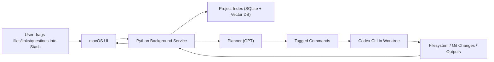

# Stash - Hackathon Build Plan

## 1) Vision and Outcome

**Stash** is a macOS overlay + assistant that lets users drop files/links/questions into one place, keeps project context indexed in the background, and triggers Codex-powered actions without context switching.

**North-star outcome for demo:** show a non-technical user create and organize real project outputs (docs/files/tasks/code changes) from one overlay.

---

## 2) Hackathon Constraints (Guardrails)

- Build window: **5 hours**
- Team size: up to **4**
- Must be **fully open source** (backend, frontend, integrations, prompts, scripts)
- Must be **new work during hackathon**
- Avoid banned categories and policy-risk use cases

---

## 3) Architecture (MVP)

## Components

1. **Frontend macOS app (SwiftUI)**
- Floating semi-transparent Stash icon overlay
- Drag/drop zone with visual feedback
- Expandable panel: project switcher, file list, quick actions, chat input
- Status feed (indexing, agent runs, task completion)

2. **Backend background process (Python)**
- Local service (FastAPI recommended) on `localhost`
- Watches project folders, indexes files/links/notes
- Runs Codex CLI tasks in controlled worktrees
- Manages skill usage (indexing skill + file/terminal execution skill)

3. **Context/Index Layer**
- Per-project metadata store (`SQLite`)
- Embeddings/vector index (local vector DB)
- Unified “project layer” abstraction so users see logical project context, not raw folders

4. **Agent Orchestration**
- GPT plans intent and task sequence
- Codex executes filesystem/code operations
- Tagged command protocol between planner output and executor

## High-Level Data Flow



---

## 4) Parallelization Strategy (Frontend vs Backend)

## Team Split

1. **Frontend Lead (macOS UI + UX)**
2. **Backend Lead (API + indexing + orchestration)**
3. **Integration Engineer (Codex CLI, worktrees, skill hooks, event streaming)**
4. **Demo/Pitch Engineer (script, sample data, judging-criteria proof, polish)**

## Workstream Dependencies

- Frontend and backend run in parallel after agreeing on API contract.
- Integration engineer unblocks both sides with mocked payloads first, then real wiring.
- Demo engineer can start early with seeded scenario and continuously validate “wow moments.”

---

## 5) API Contract (v1)

**Transport:** Local HTTP JSON (`http://127.0.0.1:8765`) + SSE for live events.

## Core Entities

- `Project`: `{ id, name, root_path, created_at, last_opened_at }`
- `Asset`: `{ id, project_id, kind[file|link|note], title, path_or_url, tags[], indexed_at }`
- `Task`: `{ id, project_id, prompt, status[pending|running|done|failed], output_summary, created_at }`
- `Event`: `{ type, project_id, ts, payload }`

## Endpoints

### `POST /v1/projects`
Create/open project context.

**Request**
```json
{
  "name": "Project 1",
  "root_path": "/Users/<user>/Desktop/Project1"
}
```

**Response**
```json
{
  "id": "proj_123",
  "name": "Project 1",
  "root_path": "/Users/<user>/Desktop/Project1",
  "created_at": "2026-02-05T10:00:00Z"
}
```

### `GET /v1/projects`
List projects for quick switcher.

### `POST /v1/projects/{project_id}/assets`
Register dropped file/link/note.

**Request**
```json
{
  "kind": "file",
  "title": "PRD Draft",
  "path_or_url": "/Users/<user>/Downloads/prd.md",
  "tags": ["product", "draft"]
}
```

### `POST /v1/projects/{project_id}/index`
Trigger (or retrigger) indexing.

**Response**
```json
{
  "job_id": "idx_456",
  "status": "running"
}
```

### `POST /v1/projects/{project_id}/tasks`
User asks Stash to do something (organize/create/execute).

**Request**
```json
{
  "prompt": "Organize these files and create a project brief in markdown.",
  "mode": "proactive"
}
```

**Response**
```json
{
  "id": "task_789",
  "status": "pending"
}
```

### `GET /v1/projects/{project_id}/tasks/{task_id}`
Task status and summary.

### `GET /v1/projects/{project_id}/events/stream`
SSE stream for UI updates:
- `indexing_started`
- `indexing_progress`
- `task_started`
- `codex_command_executed`
- `task_completed`
- `task_failed`

### `POST /v1/projects/{project_id}/codex/execute`
Internal endpoint used by orchestrator to run tagged command payloads safely.

---

## 6) Tagged Command Protocol (GPT -> Codex)

Use parseable tags in planner output:

```text
<codex_cmd>
worktree: stash/proj_123
cwd: /Users/<user>/Desktop/Project1
cmd: create file PROJECT_BRIEF.md with sections...
</codex_cmd>
```

Backend parser extracts blocks, validates against allowlist, executes with Codex CLI, and returns structured results to planner loop.

---

## 7) Delivery Plan (5-Hour Timeline)

## 0:00-0:30 (Alignment + Contract Freeze)

- Lock MVP scope, success criteria, demo story
- Freeze API contract and event names
- Create repo skeleton and task board
- Seed 1 realistic demo project folder

## 0:30-2:30 (Parallel Build Sprint)

Frontend:
- Overlay icon, drag/drop, project list, expanded panel shell
- Chat input + activity feed UI with mocked events

Backend:
- FastAPI server scaffold
- Project/asset/task endpoints
- File indexing pipeline + vector insert

Integration:
- Tagged command parser
- Codex execution adapter in worktree
- SSE event broadcaster

Demo/Pitch:
- Script v1 with before/after states
- Screenshots/video capture checkpoints
- Judging criteria mapping document

## 2:30-3:30 (Real Integration)

- Connect UI to live endpoints
- Replace mocks with real events
- Run 2 end-to-end flows and patch failures fast

## 3:30-4:30 (Polish + Reliability)

- Tighten UX transitions and status messaging
- Add guardrails (error states/timeouts/fallbacks)
- Open-source/license/readme cleanup

## 4:30-5:00 (Demo Lock)

- Freeze code except critical fixes
- Rehearse 3-5 minute demo twice
- Final pitch narrative + judging callouts

---

## 8) Final Super Plan (Execution Checklist)

## A. Build Priorities (Must/Should/Could)

**Must**
- Overlay drag/drop + project switch
- Background indexing per project
- Task prompt -> Codex execution -> visible result
- One polished end-to-end demo flow

**Should**
- Proactive suggestions from indexed context
- Link ingestion and lightweight summarization
- Multi-project quick-switch performance

**Could**
- Fine-grained permission controls
- Advanced ranking for retrieval

## B. End-to-End Demo Flow (Target)

1. User drops files + links into Stash.
2. Backend auto-indexes and shows progress in UI.
3. User asks: “Create a project brief and organize assets by topic.”
4. Planner emits tagged commands; Codex executes in worktree.
5. New files appear in project root; UI shows completion summary.
6. User switches project and repeats quickly (proves multi-project context).

## C. Judging Criteria Coverage

1. **Impact (25%)**
- Position Stash as “developer-enablement OS layer” for non-coders.
- Show practical outcomes: organized files, generated docs, actionable project outputs.

2. **Codex App (25%)**
- Demonstrate real Codex worktree operations and agent-driven edits end-to-end.
- Explicitly narrate planner -> tagged command -> Codex execution loop.

3. **Creative Use of Skills (25%)**
- Show indexing skill + file/terminal skill usage in real workflows.
- Highlight on-the-fly skill generation/adaptation for project needs.

4. **Demo & Pitch (25%)**
- Fast, visual, concrete workflow with clear before/after.
- Keep live demo centered on one compelling user job-to-be-done.

## D. Risk Controls

- **Risk:** API/UI mismatch  
  **Mitigation:** Contract freeze in first 30 minutes + mocked payload tests.
- **Risk:** Codex command reliability  
  **Mitigation:** Allowlist commands and strict parser; add fallback task mode.
- **Risk:** Over-scoping  
  **Mitigation:** Must/Should/Could gates and hard demo lock at 4:30.

## E. Definition of Done (Hackathon)

- Working macOS overlay app
- Working Python background service with API + SSE
- At least one fully reliable end-to-end flow in live demo
- Public repo with license, setup instructions, and architecture notes

---

## 9) Suggested Repo Layout

```text
stash/
  frontend-macos/
  backend-service/
  shared-contract/
    openapi.yaml
    events.md
  demo-assets/
  docs/
    architecture.md
    pitch-outline.md
```

---

## 10) First 10 Commands to Execute

1. Initialize monorepo and folder structure.
2. Create `shared-contract/openapi.yaml` with endpoints above.
3. Scaffold FastAPI backend with `/v1/projects` and `/events/stream`.
4. Scaffold SwiftUI app with overlay window and drop target.
5. Implement project create/list in backend + connect from frontend.
6. Implement asset ingestion endpoint and drag/drop binding.
7. Implement indexing stub + event emission.
8. Implement task endpoint + tagged command parser stub.
9. Wire Codex CLI execution adapter (single safe command path first).
10. Rehearse end-to-end demo and lock scope.

